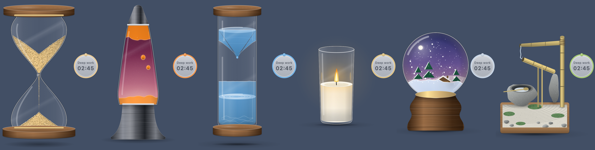

# Focus Timer

A small macOS timer that floats above your other windows and shows time passing as something physical: sand running through an hourglass, wax drifting in a lava lamp, water dripping into a glass column, a candle burning down, snow settling in a globe, or a bamboo fountain filling a stone basin.



Everything is drawn and synthesised in code. There are no image or sound files: the sand, water, flame, wax and snow are simulated, and each style has its own sound generated live from the simulation (the drip you see is the plink you hear).

## Install

Download `Focus.Timer.app.zip` from the [Releases](../../releases) page, unzip it and move **Focus Timer.app** to your Applications folder.

The app is not notarised by Apple, so the first time you open it macOS will say it cannot verify the developer. Right-click the app and choose **Open**, or go to **System Settings › Privacy & Security** and click **Open Anyway**. This is only needed once.

Requires macOS 14 or later on Apple Silicon.

## Use

- **Click** the timer to start or pause. **Double-click** to flip: the time already used becomes the new remaining time (the hourglass turns over, the globe is shaken, the candle is swapped).
- **Scroll** over it to set the minutes. **Hold ⌥ and scroll** to resize it.
- **Drag** it anywhere; it remembers its place.
- **Move the mouse over it** and it answers: the candle flame leans toward the cursor and flutters if you move fast, the lava lamp's wax drifts toward it, water ripples where you cross it, the snow scatters, and the hourglass tilts a little.
- **Right-click** (or use the menu-bar icon) for timers (5 to 90 minutes, or custom), a focus-task label, the six **Styles** and their colours, the wooden or metal **Frame** finish, sizes, sound, a chime when done, keep-on-top and open-at-login.

## Sounds

Each style has sounds that follow what is on screen, and a set of ambient sounds (brown, pink, ocean, soft hiss, gentle rain, fireplace) is available in every style. The volume slider and a preview are in the Sound menu.

| Style | Live sound |
|---|---|
| Sand hourglass | Grains landing: bright on bare glass, softer as the sand bed builds |
| Lava lamp | A warm hum with a soft bloop as each drip lands |
| Water clock | Each drop's plink, rising in pitch as the column fills (or cave drips with an echo) |
| Candle | The flame's flutter; a soft whoof when lit, a hiss when it goes out |
| Snow globe | A winter wind that eases as the snow settles |
| Zen garden | The trickle, the pour, and the bamboo tube's knock on the stone |

## Build from source

You need Xcode's command-line tools (`xcode-select --install`).

```bash
./build.sh
```

This compiles the Swift sources, packages **Focus Timer.app** with its icon and installs it to `~/Applications`.

## Licence

MIT. See [LICENSE](LICENSE).
